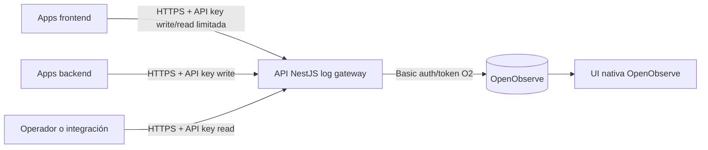

# Especificación funcional y técnica - API de logging centralizado sobre OpenObserve


Documento para entregar a un programador o equipo de desarrollo.

El objetivo es que la persona que implemente no tenga que adivinar el alcance, los contratos HTTP, las decisiones de seguridad, los casos de error ni los criterios de aceptación. Las decisiones técnicas del MVP quedan cerradas en este documento; solo faltan datos concretos del entorno para completar ejemplos y configuración.

---

## 1. Resumen ejecutivo

Se quiere construir una API intermedia en NestJS que reciba logs de aplicaciones propias y los reenvíe a OpenObserve, evitando exponer credenciales internas de OpenObserve en los clientes.

La API tendrá dos responsabilidades principales:

1. Ingestar logs desde aplicaciones frontend y backend.
2. Consultar logs filtrados de forma programática.

La visualización, dashboards, alertas e informes se harán en la UI nativa de OpenObserve y quedan fuera del desarrollo de esta API.

---

## 2. Problema

Actualmente se necesita centralizar logs de varias aplicaciones propias en una plataforma única de observabilidad. OpenObserve será el motor de almacenamiento, búsqueda y análisis.

Enviar logs directamente a OpenObserve desde cada aplicación tiene varios problemas:

- Las credenciales de OpenObserve quedarían repartidas entre múltiples aplicaciones.
- En frontend, cualquier secreto incluido en el navegador debe considerarse público.
- Cada aplicación tendría que conocer detalles internos de OpenObserve.
- Sería más difícil aplicar validación, normalización, rate limit y aislamiento por aplicación.

---

## 3. Solución propuesta

Crear una API intermedia, llamada en este documento `log gateway`, con estas propiedades:

- Es el único componente que conoce las credenciales de OpenObserve.
- Cada aplicación cliente usa una API key propia contra el gateway.
- La API valida, normaliza y reenvía los logs a OpenObserve.
- Cada aplicación escribe en su propio stream de OpenObserve.
- La API permite consultar logs mediante endpoints propios sin exponer OpenObserve directamente.
- Los clientes deben tratar el envío de logs como best effort: si falla el logging, no debe fallar la lógica de negocio.

---

## 4. Objetivos

| ID | Objetivo |
|---|---|
| O1 | Permitir que aplicaciones propias envíen logs con integración mínima. |
| O2 | Evitar que credenciales de OpenObserve vivan fuera del gateway. |
| O3 | Aislar logs por aplicación mediante un stream por servicio. |
| O4 | Normalizar el formato de logs para facilitar búsquedas y dashboards. |
| O5 | Permitir consultas programáticas de logs con filtros seguros. |
| O6 | Evitar que fallos o lentitud del sistema de logging rompan aplicaciones cliente. |
| O7 | Dejar despliegue, configuración, tests y operación documentados. |

---

## 5. Fuera de alcance

| Fuera de alcance | Motivo |
|---|---|
| Dashboards, gráficas e informes propios | Se usa la UI nativa de OpenObserve. |
| Panel de administración para gestionar aplicaciones y API keys | En MVP se gestionan por configuración. |
| Redacción automática avanzada de PII | El MVP solo enmascara campos sensibles conocidos; no implementa detección avanzada de PII. |
| Trazas distribuidas completas | Solo se almacenan `trace_id` y `span_id` si el cliente los envía. |
| Métricas de negocio de las aplicaciones cliente | Este documento cubre logs, no métricas funcionales. |
| Garantía de entrega exactamente una vez | En logging se aceptan duplicados y posible pérdida según la estrategia de cola elegida. |

---

## 6. Glosario

| Término | Significado |
|---|---|
| OpenObserve / O2 | Motor de observabilidad que almacena y consulta logs. |
| Stream | Colección de eventos en OpenObserve. En este proyecto habrá un stream por aplicación/servicio. |
| Organización | Contenedor lógico de streams en OpenObserve. En MVP se usará una sola organización. |
| API key de aplicación | Secreto usado por una aplicación para autenticarse contra el gateway. No es una credencial de OpenObserve. |
| Log gateway | API NestJS objeto de este desarrollo. |
| Fire and forget | Patrón de envío en el que la aplicación cliente no bloquea su lógica por el resultado del logging. |
| DLQ / dead-letter | Almacenamiento de eventos que no se han podido entregar tras reintentos. |

---

## 7. Arquitectura



### 7.1 Componentes

| Componente | Responsabilidad |
|---|---|
| OpenObserve | Almacenamiento, búsqueda, dashboards y alertas. |
| API NestJS | Autenticación cliente, validación, normalización, rate limit, envío a O2 y consulta. |
| Clientes backend | Enviar logs mediante snippet o HTTP directo. |
| Clientes frontend | Enviar logs y consultar información reducida de su propio servicio con CORS restringido y rate limit. |
| Coolify | Despliegue, variables de entorno, secretos, TLS y healthchecks. |

### 7.2 Principios de diseño

- El gateway no debe exponer credenciales ni endpoints internos de OpenObserve.
- La ingesta debe ser rápida y no bloquear al cliente por latencia de O2.
- Los contratos HTTP deben ser estables y versionados.
- La API debe validar entradas de forma estricta.
- La consulta debe construir SQL de forma segura, con allowlists y escape correcto.
- El sistema debe ser operable: healthchecks, logs propios, métricas y documentación.

---

## 8. Decisiones ya tomadas

| ID | Decisión |
|---|---|
| D1 | Stack principal: NestJS con TypeScript. |
| D2 | Motor de almacenamiento: OpenObserve self-hosted. |
| D3 | Despliegue objetivo: Coolify. |
| D4 | Un stream de OpenObserve por aplicación/servicio. |
| D5 | Una organización de OpenObserve para el MVP. |
| D6 | Autenticación de clientes mediante `Authorization: Bearer <API_KEY>`. |
| D7 | Visualización y dashboards fuera de alcance de la API. |
| D8 | API versionada bajo `/api/v1`. |
| D9 | El MVP usa entrega best effort con cola en memoria, reintentos y métricas; se acepta posible pérdida de logs en reinicios o caídas. |
| D10 | El MVP se despliega con una sola réplica de la API. |
| D11 | `/api/v1/metrics` entra en el MVP con métricas básicas. |
| D12 | La propia API enviará logs internos al stream `log_gateway` y también escribirá en stdout/stderr. |
| D13 | Las API keys de frontend no se consideran secretas; solo limitan alcance, origen permitido y caudal. |
| D14 | Los campos sensibles conocidos se enmascaran y el registro se acepta. |
| D15 | Se permiten IDs técnicos en logs; no se permiten datos personales directos como email, teléfono, nombre completo, DNI/NIF, tarjeta o IBAN. |
| D16 | `level` normaliza equivalencias conocidas y rechaza valores desconocidos. |
| D17 | Se aceptan duplicados por reintentos; no hay deduplicación en MVP. |
| D18 | Se permite lectura desde frontend, pero solo del propio `service`/`env`, con respuesta reducida y restricciones específicas. |
| D19 | En producción no se permite `services: ["*"]`; todas las keys deben listar servicios explícitos. |
| D20 | Los entornos válidos se configuran con `ALLOWED_ENVS`; por defecto `prod,staging,dev,test`. |
| D21 | La retención será mixta: valores por defecto por entorno y excepciones por stream si hace falta. |
| D22 | Si `context` excede límites, se recorta, se acepta el registro y se marca `context_truncated: true`. |
| D23 | Los campos desconocidos en raíz se mueven a `context.extra`. |
| D24 | El MVP entrega snippets y documentación, no SDK npm reutilizable. |
| D25 | La colección de pruebas manuales se entregará en Postman. |
| D26 | El frontend no usará `sendBeacon` en MVP; usará `fetch` con `keepalive` y `Authorization`. |
| D27 | Habrá `GET /api/v1/services` y devolverá servicios, entornos, scopes y límites aplicables a la key actual. |
| D28 | La lectura frontend puede ver todos los logs de su propio `service` y `env`; no se limita por usuario ni sesión en el MVP. |
| D29 | Las IPs se pueden guardar completas en logs. |
| D30 | No hay requisitos legales, auditoría o compliance específicos para el MVP más allá de las políticas de seguridad y retención definidas. |
| D31 | `/api/v1/metrics` expondrá formato Prometheus y el README incluirá un ejemplo de scrape config, sin desplegar Prometheus como parte del MVP. |

---

## 9. Datos de entorno pendientes

No quedan decisiones técnicas abiertas para el MVP. Sí faltan estos valores concretos para sustituir placeholders en ejemplos, CORS y configuración inicial.

| ID | Dato pendiente | Placeholder actual |
|---|---|---|
| E1 | Dominio final de la API. | `https://logs.tu-dominio.com` |
| E2 | Dominios frontend permitidos por entorno. | `https://shop.example.com` |
| E3 | Servicios iniciales y nombres de stream. | `web_shop`, `payments_api`, `auth_service` |

---

## 10. Historias de usuario

### HU1 - Enviar un log individual

Como aplicación cliente, quiero enviar un evento de log a la API para que quede almacenado en OpenObserve sin conocer sus credenciales.

**Criterios de aceptación**

- Dada una API key válida con permiso `write`, cuando envío un log válido a `POST /api/v1/logs`, entonces recibo `202 Accepted`.
- El log aparece en el stream correspondiente de OpenObserve.
- Si no envío `_timestamp`, la API lo rellena con la hora de recepción.
- Si envío un `service` no autorizado para mi key, el registro se rechaza.

### HU2 - Enviar logs por lote

Como aplicación cliente, quiero enviar varios logs en una sola llamada para reducir overhead de red.

**Criterios de aceptación**

- `POST /api/v1/logs` acepta un objeto o un array.
- `POST /api/v1/logs/batch` exige un array.
- Se aceptan parcialmente los registros válidos y se devuelven errores por índice para los inválidos.
- El tamaño máximo de body y número máximo de registros son configurables.
- `POST /api/v1/logs/batch` acepta `Content-Encoding: gzip`.

### HU3 - No romper la aplicación cliente si falla el logging

Como propietario de una aplicación cliente, quiero que el fallo del logging no interrumpa funcionalidades de negocio.

**Criterios de aceptación**

- Los snippets de referencia capturan errores de red y no los propagan.
- Los snippets usan buffer, flush periódico y límite de reintentos.
- Si la API responde error o timeout, el cliente puede descartar o reintentar con límite.

### HU4 - Consultar logs por servicio y filtros básicos

Como operador o integración interna, quiero consultar logs por servicio, rango temporal, nivel y texto para automatizar análisis.

**Criterios de aceptación**

- `GET /api/v1/logs` exige `service`.
- La key de lectura debe estar autorizada para ese `service`.
- Se soportan filtros `from`, `to`, `level`, `env`, `q`, `trace_id`, `request_id`, `limit`, `cursor` y `sort`.
- La consulta no permite inyección SQL.
- La respuesta devuelve `items` y `next_cursor`.

### HU5 - Aislar logs por aplicación

Como responsable de seguridad, quiero que una aplicación solo pueda escribir y leer los streams que tenga autorizados.

**Criterios de aceptación**

- La API key define `services` y `scopes`.
- Una key `write` solo puede escribir en sus servicios autorizados.
- Una key `read` solo puede consultar sus servicios autorizados.
- Una key con `services: ["*"]` solo debe usarse para lectura/observabilidad interna.

### HU6 - Gestionar API keys por configuración

Como operador, quiero gestionar API keys sin base de datos para mantener la API stateless en el MVP.

**Criterios de aceptación**

- Las keys se cargan desde `API_KEYS_JSON` o desde un fichero montado.
- Los secretos no se guardan en claro.
- Existe un comando `npm run keygen`.
- La comparación de secretos se hace en tiempo constante.
- La rotación se hace añadiendo una key nueva, migrando clientes y retirando la antigua.

### HU7 - Verificar salud del servicio

Como operador de Coolify, quiero endpoints de salud para saber si la API está viva y lista.

**Criterios de aceptación**

- `GET /api/v1/health` devuelve `200` si el proceso está vivo.
- `GET /api/v1/health/ready` comprueba conectividad con OpenObserve.
- Si O2 no responde, readiness devuelve `503`.

### HU8 - Limitar abuso y errores de clientes

Como responsable de plataforma, quiero rate limit y límites de payload para evitar que un cliente degrade el servicio.

**Criterios de aceptación**

- Hay rate limit por API key.
- Hay límite de tamaño de body.
- Hay límite de registros por lote.
- Hay límite de campos por registro.
- Hay límite de longitud para `message` y para valores de `context`.

### HU9 - Observar la propia API

Como operador, quiero que el gateway emita logs y métricas propias para detectar fallos de ingesta.

**Criterios de aceptación**

- La API registra aceptados, rechazados, rate limited, fallos contra O2 y tamaño de cola.
- Los logs propios no incluyen secretos ni payload completo de clientes.
- Expone `/api/v1/metrics` compatible con Prometheus desde el MVP.
- Envía sus propios logs a un stream `log_gateway` y también escribe a stdout/stderr.
- Si falla el envío de logs internos a OpenObserve, no entra en bucles recursivos de logging.

### HU10 - Desplegar reproduciblemente

Como operador, quiero poder desplegar la solución en Coolify con configuración clara.

**Criterios de aceptación**

- El repositorio incluye `Dockerfile`.
- El README explica variables de entorno, ejecución local y despliegue.
- Los secretos se inyectan desde Coolify.
- El healthcheck de Coolify apunta a `/api/v1/health/ready`.

### HU11 - Leer logs desde frontend con alcance reducido

Como aplicación frontend, quiero consultar logs de mi propio servicio y entorno para mostrar información técnica acotada sin exponer logs internos de otros servicios.

**Criterios de aceptación**

- Una key frontend con scope `read` solo puede consultar su propio `service` y `env`.
- Una key frontend puede ver todos los logs de ese `service` y `env`; no se aplica filtro obligatorio por usuario ni sesión en el MVP.
- La respuesta frontend es reducida: `_timestamp`, `level`, `message`, `service`, `env`, `request_id`, `trace_id` y `context` filtrado.
- Las keys frontend no pueden usar el parámetro `q`.
- Las keys frontend pueden filtrar por `request_id` y `trace_id`.
- Las keys frontend tienen ventana máxima de consulta de 7 días.
- Si piden una ventana mayor, la API la recorta y devuelve `range_truncated: true`.
- Las keys frontend tienen `limit` máximo 500.
- Si piden más de 500, la API recorta y devuelve `limit_truncated: true`.

### HU12 - Descubrir servicios autorizados

Como consumidor de la API, quiero consultar qué servicios, entornos, permisos y límites tiene mi key para configurar clientes y pruebas sin mirar secretos internos.

**Criterios de aceptación**

- `GET /api/v1/services` devuelve solo información autorizada para la key actual.
- La respuesta incluye servicios, entornos, scopes y límites aplicables.
- No devuelve hashes, secretos ni información de otras keys.

---

## 11. Modelo de datos

### 11.1 Evento de log normalizado

| Campo | Tipo | Obligatorio | Descripción |
|---|---|---|---|
| `_timestamp` | string ISO-8601 o int64 en microsegundos | No | Momento del evento. Si falta, la API lo rellena. |
| `service` | string | Sí | Servicio/aplicación emisora. Debe coincidir con el stream destino. |
| `env` | enum | Sí | `prod`, `staging`, `dev`, `test`. |
| `version` | string | No | Versión de la aplicación emisora. |
| `level` | enum | Sí | `trace`, `debug`, `info`, `warn`, `error`, `fatal`. |
| `message` | string | Sí | Mensaje legible. Campo principal de búsqueda full-text. |
| `event_id` | string | No | ID único opcional generado por el cliente para trazabilidad/deduplicación futura. |
| `trace_id` | string | No | ID de traza distribuida. |
| `span_id` | string | No | ID de span. |
| `request_id` | string | No | ID de petición/correlación interna. |
| `hostname` | string | No | Host, instancia o pod de origen. |
| `source` | enum | No | `backend`, `frontend`, `worker`, `cron`, `mobile`, `unknown`. |
| `context` | object | No | Pares clave-valor adicionales. |

### 11.2 Reglas de validación

- `service` debe cumplir `^[a-z0-9_]{3,64}$`.
- `service` debe estar permitido por la API key.
- `env` solo acepta valores configurados en `ALLOWED_ENVS`.
- `level` se normaliza a minúsculas.
- Equivalencias conocidas de `level` se normalizan: `warning -> warn`, `err -> error`, `critical -> fatal`.
- Si `level` sigue siendo desconocido tras normalizar equivalencias, el registro se rechaza con `invalid_level`.
- `message` debe tener entre 1 y `LOG_MESSAGE_MAX_CHARS` caracteres.
- `context` debe ser un objeto JSON, no array ni string.
- Si `context` supera `CONTEXT_MAX_DEPTH`, se recorta y se marca `context_truncated: true`.
- Si el registro supera `MAX_FIELDS_PER_RECORD`, se recorta `context` y se marca `context_truncated: true`.
- No se registran secretos ni API keys en los logs de la propia API.

### 11.3 Normalización

- Si `_timestamp` falta, se añade con la hora de recepción de la API.
- Si `_timestamp` viene en ISO-8601, se conserva y se convierte internamente si O2 requiere microsegundos.
- `context` se aplana con notación por puntos hasta la profundidad configurada.
- Los campos no reconocidos en raíz se mueven siempre a `context.extra`.
- Los campos sensibles conocidos se enmascaran con `***redacted***`.
- Los valores `undefined`, `NaN` o no serializables se eliminan o convierten a string de forma controlada.

### 11.4 Duplicados

En MVP, los duplicados son aceptables. Un reintento de cliente o de gateway puede producir eventos repetidos.

`event_id` es opcional y solo sirve para trazabilidad o análisis posterior. No habrá deduplicación estricta en el MVP.

---

## 12. Organización de streams en OpenObserve

- Organización: una sola, configurada con `O2_ORG`.
- Tipo de stream: `logs`.
- Convención de stream: igual a `service`.
- Nombre de stream: `^[a-z0-9_]{3,64}$`.
- Creación de stream: se crea automáticamente con la primera ingesta aceptada por OpenObserve.

Ejemplos:

| Aplicación | `service` / stream |
|---|---|
| API de pagos | `payments_api` |
| Web shop frontend | `web_shop` |
| Servicio de autenticación | `auth_service` |
| Gateway de logs | `log_gateway` |

---

## 13. Índices, búsqueda y retención en OpenObserve

Estos ajustes se documentan aquí, aunque pueden aplicarse desde la UI/API de OpenObserve.

| Campo | Estrategia recomendada | Motivo |
|---|---|---|
| `message` | Full-text / inverted index | Búsqueda libre. |
| `level` | Secondary index o equivalente | Baja cardinalidad. |
| `env` | Secondary index o equivalente | Baja cardinalidad. |
| `service` | Secondary index o equivalente | Filtro constante. |
| `trace_id` | Bloom filter o índice de igualdad | Alta cardinalidad, búsqueda exacta. |
| `request_id` | Bloom filter o índice de igualdad | Alta cardinalidad, búsqueda exacta. |
| `hostname` | Secondary index | Cardinalidad media. |

Retención recomendada:

| Entorno | Retención inicial |
|---|---|
| `prod` | 90 días |
| `staging` | 30 días |
| `dev` | 30 días |
| `test` | 7 días |

La política será mixta: estos valores actúan como defaults por entorno y se permiten excepciones por stream/servicio cuando haga falta.

---

## 14. Contrato HTTP

Base URL de ejemplo:

```text
https://logs.tu-dominio.com
```

Prefijo:

```text
/api/v1
```

Formato:

- Request: JSON UTF-8.
- Response: JSON UTF-8.
- Autenticación: `Authorization: Bearer <API_KEY>`.

### 14.1 Autenticación

Todas las llamadas, salvo health liveness si se decide dejar público, requieren:

```http
Authorization: Bearer <API_KEY>
```

Reglas:

- Sin cabecera o con formato inválido: `401`.
- API key inexistente: `401`.
- API key válida sin scope necesario: `403`.
- API key válida sin acceso al `service`: `403` en operaciones de consulta; rechazo por registro en ingesta parcial.

### 14.2 `POST /api/v1/logs`

Envía un log o varios logs.

Acepta:

- Un objeto `LogEvent`.
- Un array de `LogEvent`.

Request:

```http
POST /api/v1/logs
Authorization: Bearer ak_live_xxx
Content-Type: application/json
```

```json
[
  {
    "service": "payments_api",
    "env": "prod",
    "version": "1.4.2",
    "level": "error",
    "message": "timeout contacting bank gateway",
    "trace_id": "4bf92f3577b34da6a3ce929d0e0e4736",
    "span_id": "00f067aa0ba902b7",
    "request_id": "req-9f3d",
    "hostname": "pay-pod-7",
    "source": "backend",
    "context": {
      "gateway": "redsys",
      "timeout_ms": 3000
    }
  }
]
```

Response con registros aceptados:

```http
202 Accepted
```

```json
{
  "accepted": 1,
  "rejected": 0,
  "request_id": "lgw_01JZ..."
}
```

Response con aceptación parcial:

```http
202 Accepted
```

```json
{
  "accepted": 1,
  "rejected": 1,
  "errors": [
    {
      "index": 1,
      "code": "missing_required_field",
      "message": "missing required field: message"
    }
  ],
  "request_id": "lgw_01JZ..."
}
```

Response sin ningún registro válido:

```http
400 Bad Request
```

```json
{
  "error": {
    "code": "validation_error",
    "message": "no valid log records in request",
    "details": [
      {
        "index": 0,
        "code": "missing_required_field",
        "message": "missing required field: message"
      }
    ]
  },
  "request_id": "lgw_01JZ..."
}
```

### 14.3 `POST /api/v1/logs/batch`

Endpoint para lotes grandes.

Diferencias respecto a `/logs`:

- El body debe ser siempre un array.
- Acepta `Content-Encoding: gzip`.
- Rechaza más de `INGEST_MAX_BATCH` registros.
- Rechaza bodies mayores que `INGEST_MAX_BODY_MB`.

Valores por defecto:

| Límite | Valor inicial |
|---|---|
| `INGEST_MAX_BATCH` | 1000 registros |
| `INGEST_MAX_BODY_MB` | 5 MB |
| `LOG_MESSAGE_MAX_CHARS` | 8000 |
| `MAX_FIELDS_PER_RECORD` | 200 |
| `CONTEXT_MAX_DEPTH` | 2 |

### 14.4 `GET /api/v1/logs`

Consulta logs de un stream autorizado.

Query params:

| Parámetro | Tipo | Obligatorio | Descripción |
|---|---|---|---|
| `service` | string | Sí | Stream/aplicación a consultar. |
| `from` | ISO-8601 | No | Inicio del rango. Por defecto `now-1h`. |
| `to` | ISO-8601 | No | Fin del rango. Por defecto `now`. |
| `level` | string | No | Uno o varios niveles separados por coma. |
| `env` | string | No | Entorno. |
| `q` | string | No | Búsqueda full-text. |
| `trace_id` | string | No | Filtro exacto. |
| `request_id` | string | No | Filtro exacto. |
| `limit` | int | No | Por defecto 100, máximo 1000. |
| `cursor` | string | No | Cursor opaco. |
| `sort` | enum | No | `asc` o `desc`. Por defecto `desc`. |

Restricciones específicas para keys frontend:

- Solo pueden consultar servicios y entornos explícitamente autorizados en su key.
- No pueden usar `q`.
- Solo reciben respuesta reducida.
- Ventana temporal máxima: 7 días.
- Si piden una ventana mayor, la API recorta el rango y devuelve `range_truncated: true`.
- `limit` máximo: 500.
- Si piden más de 500, la API recorta y devuelve `limit_truncated: true`.

Response:

```json
{
  "total": 2,
  "items": [
    {
      "_timestamp": "2026-06-06T10:21:33.123Z",
      "service": "payments_api",
      "env": "prod",
      "level": "error",
      "message": "timeout contacting bank gateway",
      "trace_id": "4bf92f3577b34da6a3ce929d0e0e4736",
      "request_id": "req-9f3d",
      "context": {
        "gateway": "redsys",
        "timeout_ms": 3000
      }
    }
  ],
  "next_cursor": "eyJmcm9tIjoxMDB9",
  "range_truncated": false,
  "limit_truncated": false,
  "request_id": "lgw_01JZ..."
}
```

### 14.5 `GET /api/v1/health`

Liveness.

- No comprueba OpenObserve.
- Devuelve `200` si el proceso HTTP responde.

### 14.6 `GET /api/v1/health/ready`

Readiness.

- Comprueba que la API puede comunicarse con OpenObserve.
- Devuelve `200` si está lista para recibir tráfico.
- Devuelve `503` si O2 no responde o credenciales/configuración son inválidas.

### 14.7 `GET /api/v1/metrics`

Endpoint incluido en el MVP. Compatible con Prometheus.

El README debe incluir un ejemplo de `scrape_config`, pero el despliegue de Prometheus/Grafana queda fuera del MVP.

Métricas mínimas:

- `log_gateway_ingest_accepted_total`
- `log_gateway_ingest_rejected_total`
- `log_gateway_o2_delivery_failed_total`
- `log_gateway_o2_delivery_retried_total`
- `log_gateway_queue_depth`
- `log_gateway_rate_limited_total`
- `log_gateway_request_duration_seconds`
- `log_gateway_redacted_fields_total`
- `log_gateway_context_truncated_total`

### 14.8 `GET /api/v1/services`

Devuelve las capacidades de la API key usada en la petición.

Response:

```json
{
  "services": [
    {
      "name": "web_shop",
      "envs": ["prod"],
      "scopes": ["read", "write"],
      "limits": {
        "max_query_window": "7d",
        "max_limit": 500,
        "allow_q": false,
        "response_profile": "frontend_reduced"
      }
    }
  ],
  "request_id": "lgw_01JZ..."
}
```

Reglas:

- Requiere API key válida.
- Solo devuelve lo permitido para esa key.
- No expone secretos, hashes ni configuración de otras keys.

---

## 15. Códigos de error

| HTTP | Código interno | Cuándo |
|---|---|---|
| `200` | `ok` | Consulta correcta o health correcto. |
| `202` | `accepted` | Ingesta aceptada total o parcialmente. |
| `400` | `validation_error` | JSON mal formado, body inválido o cero registros válidos. |
| `401` | `unauthorized` | Falta API key o es inválida. |
| `403` | `forbidden` | Key válida sin permiso para la operación. |
| `413` | `payload_too_large` | Body o lote excede límites. |
| `415` | `unsupported_media_type` | Content-Type no soportado. |
| `429` | `rate_limited` | Rate limit excedido. |
| `502` | `openobserve_error` | O2 devuelve error en operación síncrona, como consulta. |
| `503` | `service_unavailable` | Readiness falla o cola saturada si se decide rechazar. |

Formato estándar:

```json
{
  "error": {
    "code": "validation_error",
    "message": "missing required field: message",
    "details": []
  },
  "request_id": "lgw_01JZ..."
}
```

---

## 16. Seguridad

### 16.1 API keys

Las API keys se definen por configuración.

Ejemplo:

```json
[
  {
    "id": "payments_api_write",
    "secret_hash": "sha256:...",
    "services": ["payments_api"],
    "scopes": ["write"],
    "allowed_origins": []
  },
  {
    "id": "web_shop_frontend",
    "secret_hash": "sha256:...",
    "services": ["web_shop"],
    "scopes": ["write", "read"],
    "allowed_origins": ["https://shop.example.com"],
    "envs": ["prod"],
    "client_type": "frontend",
    "read_policy": {
      "response_profile": "frontend_reduced",
      "allow_q": false,
      "max_query_window": "7d",
      "max_limit": 500
    }
  },
  {
    "id": "observability_reader",
    "secret_hash": "sha256:...",
    "services": ["payments_api", "web_shop", "auth_service", "log_gateway"],
    "scopes": ["read"],
    "allowed_origins": []
  }
]
```

Requisitos:

- Los secretos reales no se guardan en claro.
- Las keys deben tener alta entropía.
- La comparación debe hacerse en tiempo constante.
- Las keys de frontend son públicas en la práctica; no sirven como secreto fuerte.
- CORS ayuda en navegador, pero no impide llamadas desde scripts o servidores externos.
- Por eso las keys frontend deben estar limitadas a un stream/entorno, rate limited y ser revocables.
- En producción no se permite `services: ["*"]`; todos los servicios autorizados deben listarse explícitamente.
- Las keys frontend nunca pueden autorizar streams backend ni el stream `log_gateway`.

### 16.2 PII y secretos

Política actual:

- Las aplicaciones no deben enviar PII directa ni secretos en logs.
- Se permiten IDs técnicos como `user_id`, `account_id`, `tenant_id`, `request_id` o equivalentes.
- Se permiten IPs completas en logs.
- No se deben enviar emails, teléfonos, nombres completos, direcciones, DNI/NIF, tarjetas ni IBAN.
- La API implementa enmascarado automático de campos sensibles conocidos.
- La API sí debe evitar registrar payloads completos en sus propios logs.

Nota: si en el futuro hay requisitos legales más estrictos, la política de IPs debería revisarse y podría pasar a enmascarado parcial.

Campos sospechosos que se deben enmascarar si aparecen en `context` o en campos movidos a `context.extra`:

- `password`
- `token`
- `authorization`
- `cookie`
- `set_cookie`
- `secret`
- `api_key`
- `credit_card`
- `iban`

El valor original se sustituye por `***redacted***`. Además se incrementa `log_gateway_redacted_fields_total`.

### 16.3 Consulta segura

La API construirá consultas SQL contra OpenObserve. El programador no debe concatenar directamente input del usuario.

Requisitos:

- `service`, `level`, `env` y `sort` se validan con allowlist.
- `limit` se acota.
- `q`, `trace_id` y `request_id` se escapan correctamente.
- Los nombres de campos consultables son fijos, no arbitrarios.
- Si se añade búsqueda avanzada en el futuro, debe ir en endpoint separado y con permisos específicos.

---

## 17. Integración con OpenObserve

### 17.1 Ingesta

Endpoints oficiales relevantes:

- JSON batch: `POST /api/{organization}/{stream}/_json`
- JSON lines: `POST /api/{organization}/{stream}/_multi`
- Bulk compatible Elasticsearch: `POST /api/{organization}/_bulk`

Uso recomendado para MVP:

- Usar `_json` para lotes por stream porque el gateway ya agrupa y valida registros.
- Si un request contiene varios `service`, agrupar por `service` antes de llamar a OpenObserve.
- Usar `_multi` solo si se decide enviar JSON lines.

### 17.2 Consulta

Endpoint oficial relevante:

```text
POST /api/{organization}/_search
```

OpenObserve espera una consulta SQL y rango temporal en microsegundos.

Ejemplo interno orientativo:

```json
{
  "query": {
    "sql": "SELECT * FROM \"payments_api\" WHERE level = 'error' ORDER BY _timestamp DESC",
    "start_time": 1780736400000000,
    "end_time": 1780740000000000,
    "from": 0,
    "size": 100
  },
  "timeout": 30
}
```

Nota: `from` aquí es offset de OpenObserve. No confundir con el query param externo `from`, que representa fecha de inicio.

### 17.3 Autenticación contra OpenObserve

La documentación de OpenObserve indica autenticación HTTP Basic para APIs. El gateway debe soportar como mínimo:

- `O2_AUTH_USER`
- `O2_AUTH_PASSWORD`

Opcionalmente puede soportar token si la instalación concreta de OpenObserve lo permite.

---

## 18. Cola, reintentos y fiabilidad

Este punto debe quedar explícito porque cambia mucho el comportamiento real.

### 18.1 Modo MVP recomendado

Modo: best effort con cola en memoria acotada.

Comportamiento:

- La API valida la petición.
- Los registros válidos se agrupan por stream.
- Se introducen en una cola interna en memoria.
- La API responde `202` si los registros han entrado en cola.
- Un worker interno envía a OpenObserve con reintentos.
- Si la cola está llena, se rechaza con `503` o `429`.
- Si el proceso cae, los logs pendientes en memoria pueden perderse.
- El despliegue MVP usa una sola réplica para evitar colas en memoria repartidas.

Ventajas:

- Menor complejidad.
- Suficiente si los logs no son críticos.
- Fácil de desplegar en una sola réplica.

Limitaciones:

- No garantiza entrega durable.
- Escalar a varias réplicas reparte colas en memoria.
- Reinicios de despliegue pueden perder logs pendientes.
- No está pensado para escalar horizontalmente sin aceptar explícitamente pérdida/reordenación por instancia.

### 18.2 Modo fiable opcional

Modo: cola durable con Redis/BullMQ, base de datos ligera o spool en disco.

Comportamiento:

- La API responde `202` solo después de persistir el lote en cola durable.
- Workers consumen la cola y envían a OpenObserve.
- Los fallos tras reintentos van a DLQ.
- Permite múltiples réplicas.

Coste:

- Más infraestructura.
- Más operación.
- Más tests.

La cola durable queda fuera del MVP. Se podrá añadir en una fase posterior si los logs pasan a ser críticos.

---

## 19. Configuración

| Variable | Obligatoria | Ejemplo | Descripción |
|---|---|---|---|
| `PORT` | No | `3000` | Puerto HTTP. |
| `NODE_ENV` | No | `production` | Entorno de ejecución. |
| `O2_URL` | Sí | `http://openobserve:5080` | URL base de OpenObserve. |
| `O2_ORG` | Sí | `default` | Organización en OpenObserve. |
| `O2_AUTH_USER` | Sí | `svc-openobserve@example.com` | Usuario de servicio. |
| `O2_AUTH_PASSWORD` | Sí | `***` | Password del usuario de servicio. |
| `API_KEYS_JSON` | Sí | `[...]` | Configuración de keys. |
| `API_KEYS_FILE` | No | `/run/secrets/api-keys.json` | Alternativa a `API_KEYS_JSON`. |
| `ALLOWED_ENVS` | No | `prod,staging,dev,test` | Entornos válidos aceptados por la API. |
| `INGEST_MAX_BATCH` | No | `1000` | Máximo de registros por lote. |
| `INGEST_MAX_BODY_MB` | No | `5` | Máximo de body. |
| `LOG_MESSAGE_MAX_CHARS` | No | `8000` | Longitud máxima de `message`. |
| `CONTEXT_MAX_DEPTH` | No | `2` | Profundidad máxima de `context`. |
| `MAX_FIELDS_PER_RECORD` | No | `200` | Máximo de campos efectivos. |
| `QUEUE_MAX_ITEMS` | No | `10000` | Tamaño máximo de cola en memoria. |
| `RETRY_ATTEMPTS` | No | `3` | Reintentos contra O2. |
| `RETRY_BACKOFF_MS` | No | `200,1000,5000` | Backoff de reintentos. |
| `RATE_LIMIT_RPS` | No | `100` | Rate limit por key. |
| `CORS_ALLOWED_ORIGINS` | No | `https://app.example.com` | Orígenes permitidos globales. |
| `LOG_LEVEL` | No | `info` | Nivel de logs de la API. |
| `METRICS_ENABLED` | No | `true` | Activa `/metrics`. |

---

## 20. Despliegue en Coolify

### 20.1 OpenObserve

- Desplegar OpenObserve como servicio en Coolify.
- Crear organización inicial.
- Crear usuario de servicio para la API.
- No usar usuario root en producción si se puede evitar.
- Configurar retención e índices por stream.

### 20.2 API NestJS

- Desplegar desde repositorio con `Dockerfile`.
- Inyectar variables como secretos de Coolify.
- Configurar dominio HTTPS.
- Configurar healthcheck:

```text
GET /api/v1/health/ready
```

- Usar red interna de Coolify para que la API alcance a OpenObserve.

### 20.3 Escalado

- Con cola en memoria: empezar con una réplica.
- Con varias réplicas: usar cola compartida o aceptar pérdida/reordenación por instancia.
- Si se activa DLQ en disco, definir volumen persistente y estrategia por réplica.

---

## 21. Ejemplos de cliente

### 21.1 Backend Node.js

```ts
type LogEvent = {
  service: string;
  env: "prod" | "staging" | "dev" | "test";
  level: "trace" | "debug" | "info" | "warn" | "error" | "fatal";
  message: string;
  trace_id?: string;
  request_id?: string;
  context?: Record<string, unknown>;
};

const endpoint = `${process.env.LOG_API_URL}/api/v1/logs/batch`;
const apiKey = process.env.LOG_API_KEY!;
const buffer: LogEvent[] = [];

export function log(event: LogEvent) {
  buffer.push({
    ...event,
    _timestamp: new Date().toISOString(),
  } as LogEvent);

  if (buffer.length >= 50) {
    void flush();
  }
}

async function flush() {
  if (buffer.length === 0) return;

  const batch = buffer.splice(0, buffer.length);

  try {
    await fetch(endpoint, {
      method: "POST",
      headers: {
        Authorization: `Bearer ${apiKey}`,
        "Content-Type": "application/json",
      },
      body: JSON.stringify(batch),
      signal: AbortSignal.timeout(2000),
    });
  } catch {
    // No propagar errores de logging a la aplicación.
    // Opcional: reencolar con límite para evitar crecimiento infinito.
  }
}

setInterval(() => void flush(), 5000);
```

### 21.2 Frontend navegador

```js
const ENDPOINT = "https://logs.tu-dominio.com/api/v1/logs";
const API_KEY = "ak_live_frontend_xxx";

function sendLog(event) {
  const body = JSON.stringify([event]);

  fetch(ENDPOINT, {
    method: "POST",
    headers: {
      Authorization: `Bearer ${API_KEY}`,
      "Content-Type": "application/json",
    },
    body,
    keepalive: true,
  }).catch(() => {
    // No propagar errores de logging al usuario.
  });
}

window.addEventListener("error", (event) => {
  sendLog({
    service: "web_shop",
    env: "prod",
    level: "error",
    message: event.message,
    source: "frontend",
    context: {
      file: event.filename,
      line: event.lineno,
      column: event.colno,
    },
  });
});
```

En el MVP no se usa `sendBeacon` porque no permite añadir `Authorization: Bearer <API_KEY>` de forma fiable. Se usa `fetch` con `keepalive`, aceptando que algún log puede perderse al cerrar la pestaña.

### 21.3 Curl

```bash
curl -X POST https://logs.tu-dominio.com/api/v1/logs \
  -H "Authorization: Bearer ak_live_xxx" \
  -H "Content-Type: application/json" \
  -d '[{"service":"payments_api","env":"prod","level":"info","message":"hello world"}]'
```

---

## 22. Tests esperados

### 22.1 Unitarios

- Validación de `LogEvent`.
- Normalización de `level`, `_timestamp` y `context`.
- Autorización por scopes y services.
- Construcción segura de SQL.
- Parseo de cursores.
- Hash y comparación de API keys.

### 22.2 Integración

- `POST /logs` con un registro válido.
- `POST /logs` con array válido.
- Ingesta parcial con errores por índice.
- `POST /logs/batch` con gzip.
- Rate limit por API key.
- Consulta con filtros.
- Consulta frontend sin `q`, con respuesta reducida, ventana máxima de 7 días y `limit` máximo 500.
- `GET /api/v1/services` devuelve capacidades de la key actual.
- Enmascarado de campos sensibles.
- Recorte de `context` con `context_truncated: true`.
- `/api/v1/metrics` expone métricas mínimas.
- Health readiness con O2 disponible/no disponible.

### 22.3 E2E

- Levantar API + OpenObserve en entorno local o CI.
- Enviar logs.
- Consultarlos desde `GET /api/v1/logs`.
- Verificar que se almacenan en el stream correcto.

---

## 23. Criterios de aceptación globales

| ID | Criterio |
|---|---|
| CA1 | Una app con key `write` puede enviar un log válido y recibe `202`. |
| CA2 | Una app puede enviar un lote y recibe conteos de aceptados/rechazados. |
| CA3 | Los registros inválidos no tumban todo el lote si hay otros válidos. |
| CA4 | Si no hay ningún registro válido, la API responde `400`. |
| CA5 | Una key inválida recibe `401`. |
| CA6 | Una key válida sin scope necesario recibe `403`. |
| CA7 | Un `service` no autorizado no puede escribirse ni consultarse. |
| CA8 | Los logs aparecen en OpenObserve en el stream esperado. |
| CA9 | `GET /logs` filtra por `service`, rango temporal, `level`, `env`, `q`, `trace_id` y `request_id`. |
| CA10 | La consulta pagina con cursor opaco. |
| CA11 | El SQL generado no es vulnerable a inyección por parámetros de usuario. |
| CA12 | Los límites de body, batch, campos y rate limit se aplican. |
| CA13 | Health y readiness funcionan en Coolify. |
| CA14 | No se exponen credenciales de OpenObserve en respuestas, logs ni documentación cliente. |
| CA15 | Existe `npm run keygen`. |
| CA16 | Existe README con configuración, ejecución local, despliegue y ejemplos. |
| CA17 | Existe `Dockerfile` funcional. |
| CA18 | `/api/v1/metrics` expone métricas de ingesta, rechazo, rate limit, fallos O2, cola, redacción y truncado. |
| CA19 | `GET /api/v1/services` devuelve servicios, entornos, scopes y límites de la key actual. |
| CA20 | Las keys frontend no pueden usar `q`, reciben respuesta reducida y tienen límites de 7 días y 500 resultados. |
| CA21 | Los campos sensibles se enmascaran antes de enviarse a OpenObserve. |
| CA22 | Los tests automatizados cubren CA1-CA21 como mínimo. |

---

## 24. Entregables del programador

1. Código fuente NestJS + TypeScript.
2. `Dockerfile`.
3. README con instalación, configuración, ejecución local y despliegue en Coolify.
4. `.env.example` sin secretos reales.
5. Script `npm run keygen`.
6. Tests unitarios, integración y E2E.
7. Colección Postman de pruebas manuales.
8. Documentación de integración cliente backend/frontend.
9. Documentación de operación: healthchecks, métricas, rate limits y troubleshooting.

---

## 25. Riesgos y huecos detectados

| Riesgo | Por qué importa | Mitigación |
|---|---|---|
| Asumir que una key frontend es secreta | En navegador no hay secretos reales. | Tratarla como pública, limitar alcance, CORS y rate limit. |
| Responder `202` sin cola durable | Puede perder logs en reinicios. | Declarar best effort o añadir cola durable. |
| Concatenar SQL con filtros de usuario | Riesgo de inyección o consulta cara. | Allowlists, escape y límites estrictos. |
| No definir política de PII | Puede almacenar datos sensibles por error. | Confirmar política y añadir detección/rechazo si aplica. |
| Multi-réplica con cola local | Puede perder o duplicar logs de forma difícil de depurar. | Una réplica en MVP o cola compartida. |
| `sendBeacon` con Bearer token | No permite headers custom de forma fiable. | No usar `sendBeacon` en MVP; usar `fetch` con `keepalive`. |
| No fijar retención | Coste de almacenamiento impredecible. | Confirmar retención por entorno/stream. |
| No acotar cardinalidad de campos | Puede degradar índices y búsqueda. | Límites de campos, profundidad y longitud. |
| No definir duplicados | Reintentos pueden duplicar logs. | Aceptar duplicados o exigir `event_id`. |

---

## 26. Placeholders a sustituir antes de desplegar

1. Sustituir `https://logs.tu-dominio.com` por el dominio real.
2. Sustituir `https://shop.example.com` por los dominios frontend reales permitidos en CORS.
3. Sustituir `web_shop`, `payments_api` y `auth_service` por los servicios iniciales reales, o dejarlos si son ejemplos intencionados.
4. Generar API keys reales con `npm run keygen` y guardarlas como secretos de Coolify.

---

## 27. Referencias oficiales revisadas

- OpenObserve JSON ingestion: https://openobserve.ai/docs/reference/api/ingestion/logs/json/
- OpenObserve Multi ingestion: https://openobserve.ai/docs/reference/api/ingestion/logs/multi/
- OpenObserve Search API: https://openobserve.ai/docs/reference/api/search/search/
- OpenObserve SQL full-text functions: https://openobserve.ai/docs/reference/sql-reference/
