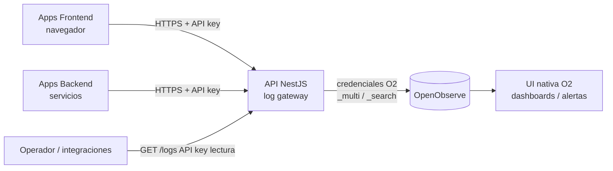

# Especificaciones — API de Logging centralizado sobre OpenObserve


> **Documento de especificaciones funcionales y técnicas** para el desarrollo de una API
> intermedia (*log gateway*) que centraliza la ingesta y consulta de logs de múltiples
> aplicaciones, usando OpenObserve como motor de almacenamiento y análisis.
> Destinatario: equipo/programador de desarrollo.

---

## 1. Contexto y objetivos

### 1.1 Problema

Se necesita centralizar los logs de varias aplicaciones propias (backend y frontend) en una
única plataforma de observabilidad (**OpenObserve**, self-hosted en Coolify). Enviar logs
*directamente* a OpenObserve desde cada aplicación obligaría a distribuir credenciales del
motor por todos los clientes, lo cual es inaceptable especialmente en frontend (cualquier
token embebido en el navegador es público).

### 1.2 Solución

Una **API intermedia en NestJS** que actúa como único punto de contacto con OpenObserve:

- Es el **único componente que conoce las credenciales de OpenObserve**.
- Las aplicaciones cliente solo conocen la URL de la API y su propia **API key**.
- La API **valida, normaliza y reenvía** los logs a OpenObserve (ingesta).
- La API expone endpoints para **recuperar y filtrar logs** (consulta programática).

### 1.3 Objetivos

| # | Objetivo |
|---|---|
| O1 | Que cualquier aplicación propia pueda enviar logs con una integración mínima y segura. |
| O2 | Que ninguna credencial de OpenObserve viva fuera de la API. |
| O3 | Que cada aplicación tenga sus logs aislados en su propio *stream*. |
| O4 | Que se puedan recuperar logs filtrados vía API para integraciones/automatismos. |
| O5 | Que el fallo o lentitud de la API **nunca** rompa ni bloquee las aplicaciones cliente. |

### 1.4 Fuera de alcance (no se desarrolla)

- **Visualización, dashboards, gráficas e informes**: se usan los nativos de la UI de OpenObserve.
- **Gestión avanzada** (alta/baja de apps por UI, panel de administración): las API keys se
  gestionan por configuración (ver §6).
- **Redacción/enmascarado de PII**: se asume que los logs **no contienen datos personales**
  (decisión de proyecto). Ver §9.4 para la política.

---

## 2. Glosario

| Término | Significado |
|---|---|
| **OpenObserve (O2)** | Motor de observabilidad que almacena y consulta los logs. |
| **Stream** | Secuencia de eventos homogéneos en O2 (equivalente a "índice"/"tabla"). Aquí: uno por aplicación. |
| **Organización** | Contenedor lógico de streams en O2. Se usa una sola. |
| **API key (de aplicación)** | Secreto que identifica y autoriza a una aplicación cliente contra **nuestra API** (no contra O2). |
| **Log gateway** | La API NestJS objeto de este documento. |
| **Fire-and-forget** | Patrón de envío en el que el cliente no espera/bloquea por la respuesta del log. |

---

## 3. Arquitectura



### 3.1 Componentes

1. **OpenObserve** (ya desplegado o a desplegar en Coolify). Almacenamiento + UI de análisis.
2. **API NestJS** (a desarrollar). *Stateless*, escalable horizontalmente.
3. **Clientes** (apps propias). Integran un pequeño SDK/snippet o llamadas HTTP directas.

### 3.2 Principios de diseño

- **Stateless**: la API no guarda estado de logs; solo reenvía y consulta. Cualquier estado
  (API keys) se carga desde configuración al arranque.
- **No es un SPOF de las apps**: el contrato con el cliente es asíncrono. Si la API no responde,
  el cliente descarta/encola pero **no falla** su lógica de negocio.
- **Resiliente hacia O2**: la API reintenta los envíos a OpenObserve con *backoff* y
  registra fallos en su propio log de errores.

---

## 4. Modelo de datos

### 4.1 Esquema estándar del evento de log

Todos los logs se normalizan a este esquema antes de enviarse a OpenObserve. Esto garantiza
dashboards, filtros y alertas reutilizables entre aplicaciones.

| Campo | Tipo | Obligatorio | Descripción |
|---|---|---|---|
| `_timestamp` | string (ISO-8601 / RFC3339) o int64 (épocas µs) | No¹ | Momento del evento. Si falta, lo añade la API (o el propio O2). |
| `service` | string | **Sí** | Nombre de la aplicación/servicio. Debe coincidir con el stream destino. |
| `env` | string | **Sí** | Entorno: `prod`, `staging`, `dev`, … |
| `version` | string | No | Versión de la app que emite (ej. `1.4.2`). |
| `level` | string (enum) | **Sí** | Severidad: `trace`,`debug`,`info`,`warn`,`error`,`fatal`. |
| `message` | string | **Sí** | Mensaje legible del evento. Campo full-text. |
| `trace_id` | string | No | ID de traza distribuida (correlación con trazas). |
| `span_id` | string | No | ID de span. |
| `request_id` | string | No | ID de petición/correlación interna. |
| `hostname` | string | No | Host/instancia/pod de origen. |
| `context` | object (JSON) | No | Pares clave-valor arbitrarios de contexto adicional. |

> ¹ `_timestamp` es opcional para el cliente, pero **siempre presente** en O2: la API lo
> rellena con la hora de recepción si el cliente no lo envía.

#### Reglas de normalización (responsabilidad de la API)

- `level` se normaliza a minúsculas y se valida contra el enum. Valores desconocidos → `info`
  con un flag `level_original` en `context`.
- `service` se valida contra la API key (la key determina qué `service`/stream puede escribir).
- El objeto `context` se **aplana** con notación por puntos solo hasta 1 nivel de profundidad
  antes de enviarse (para evitar explosión de cardinalidad de campos en O2). Configurable.
- Límite de campos por registro: O2 self-hosted permite configurar `ZO_COLS_PER_RECORD_LIMIT`.
  La API debe rechazar (o truncar `context`) registros con más de **200 campos** efectivos por defecto.

### 4.2 Organización de streams

- **Una organización** en OpenObserve (ej. `default`).
- **Un stream por aplicación**, nombre derivado del `service` con convención estable:
  `^[a-z0-9_]{3,64}$` (ej. `payments_api`, `web_shop`, `auth_service`).
- El stream se **crea automáticamente** en O2 al recibir el primer log (no requiere
  aprovisionamiento previo).
- **Tipo de stream**: `logs`.

### 4.3 Índices y retención recomendados (configuración en O2, documentada aquí)

Estos ajustes se aplican en la UI de OpenObserve por stream (no en la API), pero se
especifican como parte del diseño:

| Campo | Estrategia de índice | Motivo |
|---|---|---|
| `message` | Full-text | Búsqueda libre de texto. |
| `level`, `env`, `service` | Key-value partition / secondary | Baja cardinalidad, filtrado constante. |
| `trace_id`, `request_id`, `span_id` | Bloom filter | Alta cardinalidad, búsqueda por igualdad. |
| `hostname` | Secondary index | Cardinalidad media. |

- **Retención**: 90 días por defecto, configurable por stream (rango objetivo 30–90 días).
- **Store Original Data**: **desactivado** (no se necesita raw/forense; ahorra almacenamiento).

---

## 5. Contrato de la API

Base URL ejemplo: `https://logs.tu-dominio.com`
Prefijo de versión: `/api/v1`
Formato: JSON. Codificación: UTF-8.

### 5.1 Autenticación

Todas las llamadas requieren cabecera:

```
Authorization: Bearer <API_KEY>
```

- Las API keys de **escritura** autorizan `POST /logs*` para un `service`/stream concreto.
- Las API keys de **lectura** autorizan `GET /logs*`.
- Una key puede tener ambos permisos (ver §6).
- Petición sin key válida → `401`. Key válida pero sin permiso para la operación/stream → `403`.

### 5.2 Ingesta — `POST /api/v1/logs`

Envía **uno o varios** eventos. Cuerpo: un objeto o un array de objetos con el esquema de §4.1.

**Request**
```http
POST /api/v1/logs
Authorization: Bearer ak_live_xxx
Content-Type: application/json
```
```json
[
  {
    "service": "payments_api",
    "env": "prod",
    "version": "1.4.2",
    "level": "error",
    "message": "timeout contacting bank gateway",
    "trace_id": "4bf92f3577b34da6a3ce929d0e0e4736",
    "span_id": "00f067aa0ba902b7",
    "request_id": "req-9f3d",
    "hostname": "pay-pod-7",
    "context": { "gateway": "redsys", "timeout_ms": 3000 }
  }
]
```

**Response — `202 Accepted`** (la API acepta y reenvía de forma asíncrona)
```json
{ "accepted": 1, "rejected": 0 }
```

Si hay registros inválidos en el lote:
```json
{
  "accepted": 1,
  "rejected": 1,
  "errors": [
    { "index": 1, "reason": "missing required field: message" }
  ]
}
```

**Comportamiento**
- Validación por registro. Los válidos se aceptan aunque otros del lote fallen (ingesta parcial).
- El `service` de cada registro debe estar autorizado por la API key; si no, ese registro se
  rechaza con `reason: "service not allowed for this key"`.
- Reenvío a O2 vía endpoint `_multi`/`_json` de la organización/stream correspondiente.

### 5.3 Ingesta por lotes — `POST /api/v1/logs/batch`

Idéntico semánticamente a `POST /logs` con array, pero pensado para volúmenes grandes:
- Acepta `Content-Encoding: gzip`.
- Límite de tamaño de cuerpo configurable (por defecto 5 MB).
- Límite de registros por lote configurable (por defecto 1.000).

### 5.4 Consulta — `GET /api/v1/logs`

Recupera logs filtrados de un stream.

**Query params**

| Param | Tipo | Req. | Descripción |
|---|---|---|---|
| `service` | string | **Sí** | Stream/aplicación a consultar. Debe estar autorizado por la key. |
| `from` | string (ISO-8601) | No | Inicio del rango. Por defecto `now-1h`. |
| `to` | string (ISO-8601) | No | Fin del rango. Por defecto `now`. |
| `level` | string | No | Filtra por severidad (admite lista separada por comas). |
| `env` | string | No | Filtra por entorno. |
| `q` | string | No | Búsqueda full-text sobre `message` (traducida a `match_all`). |
| `trace_id` | string | No | Filtro exacto por traza. |
| `limit` | int | No | Máx. resultados (por defecto 100, máximo 1.000). |
| `cursor` | string | No | Paginación (opaco; ver §5.5). |
| `sort` | string | No | `asc`\|`desc` por `_timestamp` (por defecto `desc`). |

**Response — `200 OK`**
```json
{
  "total": 2,
  "items": [
    {
      "_timestamp": "2026-06-06T10:21:33.123Z",
      "service": "payments_api",
      "env": "prod",
      "level": "error",
      "message": "timeout contacting bank gateway",
      "trace_id": "4bf92f3577b34da6a3ce929d0e0e4736",
      "context": { "gateway": "redsys", "timeout_ms": 3000 }
    }
  ],
  "next_cursor": "eyJvZmZzZXQiOjEwMH0="
}
```

**Comportamiento**
- Internamente traduce los filtros a una consulta SQL contra la Search API de O2
  (`SELECT ... FROM "<stream>" WHERE ... ORDER BY _timestamp <sort> LIMIT <limit>`).
- `q` se traduce a `match_all('<q>')`.
- El rango temporal se envía como parámetros de búsqueda de O2.

### 5.5 Paginación

- Cursor opaco (Base64 de `{offset}` o de `{search_after}` según se implemente).
- La API no expone detalles internos de O2; el cliente solo reenvía `next_cursor`.

### 5.6 Salud — `GET /api/v1/health` y `GET /api/v1/health/ready`

- `health`: liveness, responde `200` si el proceso está vivo.
- `health/ready`: readiness, comprueba conectividad con O2; `503` si O2 no es accesible.

### 5.7 Códigos de error

| HTTP | Significado | Cuándo |
|---|---|---|
| `202` | Aceptado | Ingesta correcta (total o parcial). |
| `200` | OK | Consulta correcta. |
| `400` | Petición inválida | JSON mal formado, parámetros inválidos. |
| `401` | No autenticado | Falta API key o es inválida. |
| `403` | No autorizado | Key válida sin permiso sobre la operación/stream. |
| `413` | Payload demasiado grande | Supera límites de tamaño/registros. |
| `429` | Rate limit | Supera el límite de peticiones (ver §9.2). |
| `502` | Error aguas abajo | O2 devolvió error tras reintentos (solo en operaciones síncronas como consulta). |
| `503` | No disponible | O2 inaccesible (readiness). |

Formato de error estándar:
```json
{ "error": { "code": "validation_error", "message": "missing required field: message", "details": [] } }
```

---

## 6. Modelo de autenticación y gestión de keys

- Las API keys se definen en **configuración** (variable de entorno / fichero montado), no en
  base de datos (la API es stateless). Formato sugerido: JSON.
- Cada key declara: identificador, secreto (hash), aplicaciones/streams permitidos y permisos.

**Ejemplo de configuración de keys** (variable `API_KEYS_JSON` o fichero):
```json
[
  {
    "id": "payments_api_key",
    "secret_hash": "sha256:9f86d0818...",
    "services": ["payments_api"],
    "scopes": ["write"]
  },
  {
    "id": "observability_reader",
    "secret_hash": "sha256:2c26b46b6...",
    "services": ["*"],
    "scopes": ["read"]
  }
]
```

- El secreto **nunca** se guarda en claro; se compara por hash (SHA-256 + comparación en
  tiempo constante).
- `services: ["*"]` autoriza todos los streams (útil para keys de lectura/observabilidad).
- Rotación: añadir nueva key, migrar la app, retirar la antigua. Se admite tener varias keys
  activas por aplicación simultáneamente.
- Generación de keys: script/comando de utilidad (`npm run keygen`) que produce el secreto y
  su hash para pegar en la configuración.

> **Alta de una aplicación nueva**: (1) generar una key de escritura con `keygen`,
> (2) añadirla a la configuración con su `service`, (3) la app empieza a enviar; el stream se
> crea solo en O2 con el primer log. No hace falta crear el stream manualmente.

---

## 7. Integración de OpenObserve (interno de la API)

La API se comunica con O2 mediante sus APIs HTTP. Configuración necesaria (ver §8):

- **Ingesta**: `POST {O2_URL}/api/{O2_ORG}/{stream}/_multi` (JSON-lines) o `_json` (array).
  Autenticación con credenciales O2 (usuario/clave o token) configuradas **solo en la API**.
- **Consulta**: Search API de O2 (endpoint `_search` de la organización) con cuerpo SQL +
  rango temporal.
- **Reintentos**: en ingesta, *backoff* exponencial (ej. 3 intentos: 200ms, 1s, 5s). Si tras
  reintentos falla, registrar el error y (opcional, ver §9.3) volcar a un *dead-letter* local.

> Detalles exactos de payload/headers de O2: ver documentación oficial de OpenObserve
> (endpoints `_json`/`_multi` y Search API). El equipo debe confirmar la forma concreta de la
> Search API contra la versión desplegada.

---

## 8. Configuración (variables de entorno)

| Variable | Req. | Ejemplo | Descripción |
|---|---|---|---|
| `PORT` | No | `3000` | Puerto de escucha de la API. |
| `O2_URL` | **Sí** | `http://openobserve:5080` | URL base de OpenObserve. |
| `O2_ORG` | **Sí** | `default` | Organización en O2. |
| `O2_AUTH_USER` | **Sí** | `svc@dominio.com` | Usuario de servicio de O2 (no root si es posible). |
| `O2_AUTH_PASSWORD` | **Sí** | `••••••` | Credencial de O2. |
| `API_KEYS_JSON` | **Sí** | `[…]` | Definición de API keys (o ruta a fichero). |
| `INGEST_MAX_BATCH` | No | `1000` | Máx. registros por lote. |
| `INGEST_MAX_BODY_MB` | No | `5` | Máx. tamaño de cuerpo. |
| `FLATTEN_LEVEL` | No | `1` | Profundidad de aplanado de `context`. |
| `MAX_FIELDS_PER_RECORD` | No | `200` | Límite de campos efectivos por registro. |
| `RATE_LIMIT_RPS` | No | `100` | Límite de peticiones por segundo por key. |
| `CORS_ALLOWED_ORIGINS` | No | `https://app1.com,https://app2.com` | Orígenes permitidos para frontend. |
| `RETRY_ATTEMPTS` | No | `3` | Reintentos hacia O2 en ingesta. |
| `LOG_LEVEL` | No | `info` | Nivel de log de la propia API. |

> **Seguridad**: `O2_AUTH_*` y `API_KEYS_JSON` se inyectan como secretos en Coolify, nunca en
> el repositorio.

---

## 9. Requisitos no funcionales

### 9.1 Resiliencia (crítico)

- El contrato de ingesta es **asíncrono** (`202`): la API encola/reenvía sin que el cliente
  espere a O2. El cliente nunca debe depender de la disponibilidad de O2.
- Los SDK/snippets de cliente (§11) implementan **buffer + envío por lotes + descarte
  controlado**: si la API no responde, el cliente reintenta un número limitado de veces y luego
  descarta, **sin propagar la excepción a la lógica de negocio**.

### 9.2 Rendimiento

- Objetivo: la API añade latencia mínima; la ingesta responde sin bloquear en la red hacia O2
  (reenvío en segundo plano o con cola interna).
- Rate limiting por API key (`429` al superar `RATE_LIMIT_RPS`).
- Soporte de `gzip` en ingesta por lotes.

### 9.3 Fiabilidad de entrega

- Reintentos con *backoff* hacia O2.
- (Opcional / recomendado) **Dead-letter local**: si tras reintentos no se puede entregar a O2,
  persistir el lote en disco/cola para reintento posterior, evitando pérdida silenciosa.
- Métricas internas: contadores de aceptados, rechazados, fallos de entrega.

### 9.4 Seguridad

- TLS de extremo a extremo (terminación en Coolify/reverse proxy).
- Credenciales de O2 solo en la API (secretos de Coolify).
- API keys hasheadas, comparación en tiempo constante.
- CORS restringido a orígenes autorizados para ingesta desde frontend.
- **Política PII**: las aplicaciones **no deben** enviar datos personales en los logs. La API
  no enmascara (decisión de proyecto); si en el futuro hubiera PII, se añadiría una capa de
  redacción en la API (la redacción nativa de O2 es Enterprise).
- Validación estricta de entrada (tamaños, tipos, enum de `level`).

### 9.5 Observabilidad de la propia API

- La API emite sus **propios** logs estructurados (puede enviarlos a un stream `log_gateway`
  en O2, *dogfooding*).
- Endpoints de health para Coolify.
- (Opcional) Exponer métricas Prometheus en `/metrics`.

---

## 10. Despliegue en Coolify

1. **OpenObserve**: desplegar como servicio en Coolify (binario/contenedor único en modo
   single-node es suficiente para empezar; object storage opcional para abaratar). Crear un
   **usuario de servicio** para la API (evitar usar root).
2. **API NestJS**: desplegar como aplicación Coolify desde el repositorio (Dockerfile).
   - Inyectar variables de §8 como variables de entorno / secretos.
   - Configurar dominio (`logs.tu-dominio.com`) con TLS.
   - Healthcheck apuntando a `/api/v1/health/ready`.
   - Red interna de Coolify para que la API alcance a O2 por nombre de servicio
     (`O2_URL=http://openobserve:5080`).
3. **Escalado**: la API es stateless; se puede escalar a varias réplicas sin estado compartido
   (salvo el dead-letter local, que debe ser por instancia o usar volumen/cola externa).

---

## 11. Integración cliente (ejemplos de referencia)

> Estos snippets son **referencia para los consumidores** de la API y deben incluirse en la
> documentación de uso. Demuestran el patrón fire-and-forget.

### 11.1 Backend Node.js (envío por lotes con buffer)

```ts
// logger-client.ts (ejemplo simplificado)
type LogEvent = {
  service: string; env: string; level: string; message: string;
  trace_id?: string; request_id?: string; context?: Record<string, unknown>;
};

const ENDPOINT = process.env.LOG_API_URL + "/api/v1/logs/batch";
const API_KEY = process.env.LOG_API_KEY!;
const buffer: LogEvent[] = [];

function log(event: LogEvent) {
  buffer.push({ ...event, _timestamp: new Date().toISOString() } as any);
  if (buffer.length >= 50) flush();
}

async function flush() {
  if (buffer.length === 0) return;
  const batch = buffer.splice(0, buffer.length);
  try {
    await fetch(ENDPOINT, {
      method: "POST",
      headers: { "Authorization": `Bearer ${API_KEY}`, "Content-Type": "application/json" },
      body: JSON.stringify(batch),
    });
  } catch {
    // fire-and-forget: NO propagar el error a la app. Opcional: reencolar con límite.
  }
}

setInterval(flush, 5000); // envío periódico
```

### 11.2 Frontend (navegador)

```js
// Mismo patrón: buffer + flush periódico. La API key de frontend es de escritura y
// con CORS restringido. Recordar: aunque la key sea visible, la API valida origen,
// rate-limita y solo permite escribir en el stream de esa app.
const ENDPOINT = "https://logs.tu-dominio.com/api/v1/logs";
const API_KEY = "ak_live_frontend_xxx";

window.addEventListener("error", (e) => {
  navigator.sendBeacon?.(ENDPOINT, JSON.stringify([{
    service: "web_shop", env: "prod", level: "error",
    message: e.message, context: { file: e.filename, line: e.lineno }
  }]));
});
```

### 11.3 Curl (prueba rápida)

```bash
curl -X POST https://logs.tu-dominio.com/api/v1/logs \
  -H "Authorization: Bearer ak_live_xxx" \
  -H "Content-Type: application/json" \
  -d '[{"service":"payments_api","env":"prod","level":"info","message":"hello world"}]'
```

---

## 12. Criterios de aceptación

| # | Criterio |
|---|---|
| CA1 | Una app con key de escritura puede enviar 1 o N logs y recibir `202` con conteo correcto. |
| CA2 | Un registro sin campos obligatorios se rechaza con `400`/detalle, sin tumbar el resto del lote. |
| CA3 | Una key sin permiso sobre un `service` recibe `403` para ese registro/operación. |
| CA4 | Petición sin key o con key inválida recibe `401`. |
| CA5 | El stream se crea automáticamente en O2 al primer log de una app nueva. |
| CA6 | Los logs aparecen en la UI de OpenObserve en el stream correcto con el esquema esperado. |
| CA7 | `GET /logs` devuelve resultados filtrados por `service`, rango temporal, `level` y `q`, paginados. |
| CA8 | Con O2 caído, la ingesta no bloquea al cliente (responde rápido / el cliente no falla) y los reintentos funcionan al recuperarse O2. |
| CA9 | Las credenciales de O2 no aparecen en ninguna respuesta, log ni en el cliente. |
| CA10 | Rate limit devuelve `429` al superar el umbral configurado. |
| CA11 | Health/readiness reflejan correctamente la conectividad con O2. |
| CA12 | Despliegue reproducible en Coolify con secretos inyectados (no en repositorio). |

---

## 13. Entregables del programador

1. Repositorio con la API NestJS (código, tests, `Dockerfile`).
2. Tests automatizados que cubran los criterios de aceptación (al menos CA1–CA10).
3. Script `keygen` para generación de API keys.
4. README con: configuración (§8), ejecución local, despliegue en Coolify (§10) y guía de
   integración cliente (§11).
5. Colección de ejemplos (Postman/HTTP) de los endpoints.

---

## 14. Decisiones tomadas (registro)

| Decisión | Valor |
|---|---|
| Stack de la API | NestJS (Node.js + TypeScript) |
| Alcance | Ingesta + consulta |
| Análisis/gráficas | UI nativa de OpenObserve (no se desarrolla) |
| Organización de datos | Un stream por aplicación, una organización |
| Despliegue | Self-hosted en Coolify (OpenObserve + API) |
| Retención | 90 días por defecto, configurable por stream (30–90) |
| PII | No se manejan datos personales (sin redacción) |
| Alta de apps | Stream automático al primer log; API key por configuración |
| Autenticación cliente | API key (Bearer) por aplicación, con permisos write/read |

---

## 15. Puntos a confirmar por el equipo durante el desarrollo

- Forma exacta de la **Search API** de OpenObserve contra la versión concreta desplegada
  (endpoint, cuerpo SQL, parámetros de rango temporal y paginación).
- Si se usará **cola interna/dead-letter** (recomendado) o reenvío directo con reintentos en MVP.
- Si la API enviará **sus propios logs** a un stream `log_gateway` (dogfooding recomendado).
- Estrategia de **escalado del dead-letter** si se despliegan múltiples réplicas.
```
